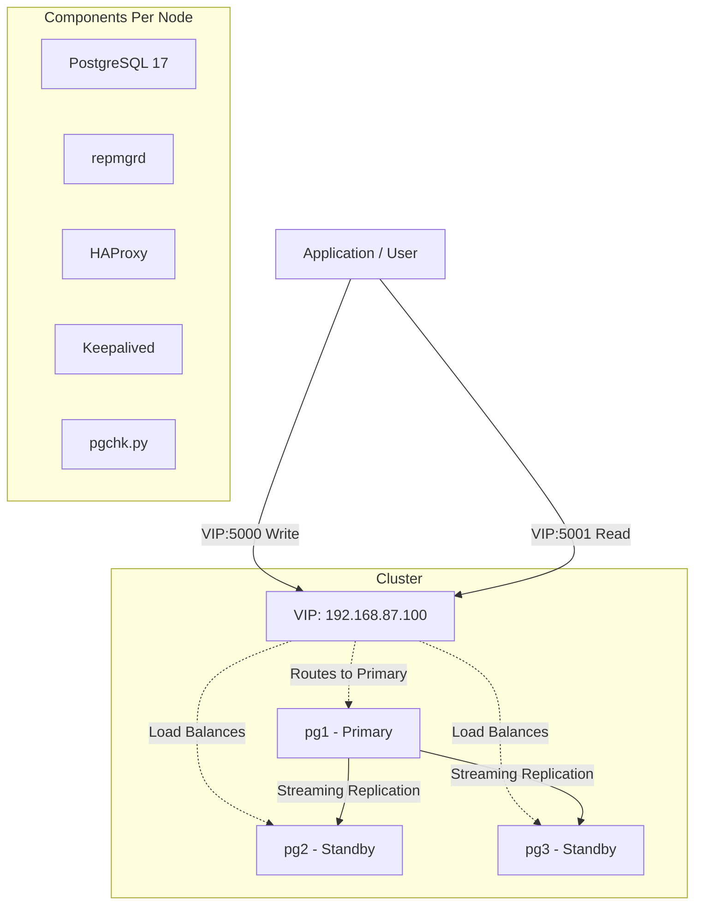

# Midmarket HA Postgres Cluster - Design, Validation, Services Packaging

**Author:** Stu Doherty
**Date:** Feb 4, 2026
**Repository:** [https://github.com/sadohert/ha-postgres-reprmgr-haproxy](https://github.com/sadohert/ha-postgres-reprmgr-haproxy)

## Summary

A common request from non-AWS customers is for help with setting up an HA Postgres cluster. They may have originally started using Mattermost on a very simple design with 1 node hosting all services (for pilot/evaluation purposes, e.g., Everfox). As their usage grows, the service-tier/classification of Mattermost grows (i.e., the business assigns higher risk to Mattermost and its availability) so the admin will investigate options to improve their disaster recovery and availability characteristics (RTO, RPO) via scaling and automation.

This project covers the design and validation of a proposed "Midmarket"/Air-Gapped HA Postgres cluster that can be "hand assembled" in a customer's data centre on VMs to solve for the above customer request. Setting up this solution could become a standard service offering from Mattermost. With a standard, properly monitored Postgres cluster Mattermost can optimize post-sale services/knowledge around this. Customers can still build it without Mattermost, but they will ideally follow our exact spec.

## Customer Prerequisites

Customer must make the following available prior to service delivery:

*   **Compute Resources (Self-Hosted Infrastructure)**
    *   **Provisioning**: Five (5) Linux Virtual Machines (VMs) dedicated to the cluster (Ubuntu 22.04 or 24.04 LTS recommended).
        *   *Database Nodes (3)*: Minimum 2 vCPU, 16GB RAM per node. Temporarily scaling to 4 vCPU is recommended during migration.
        *   *Monitoring Node (1)*: Minimum 2 vCPU, 8GB RAM.
        *   *Load Balancer Node (1)*: Minimum 2 vCPU, 4GB RAM (Nginx).
    *   **Storage**:
        *   *Database Nodes*: Sufficient high-performance block storage (e.g., NVMe/SSD) to hold the current database size + 30% growth buffer.
        *   *Monitoring Node*: 50GB+ for Prometheus metrics retention.
        *   *Load Balancer Node*: 20GB+ for logs and OS.

*   **Network & Security Configuration (Critical)**
    *   **Firewall / Allow List**:
        *   *Inter-node Communication*: Full TCP/UDP connectivity between all 5 cluster nodes on all ports (or specifically 5432, 6432, 5000, 5001, 8008, 5403, 9100, 9187).
        *   *Application Access*: Inbound traffic allowed from Mattermost application servers to the cluster VIP.
        *   *Web Access (LB)*: Inbound traffic allowed on ports 80/443 to the Nginx Load Balancer.
        *   *Migration Host Access*: Inbound traffic allowed from the designated migration host.
    *   **Connectivity Test**: Verify basic network reachability (ping/nc) between all relevant nodes.

*   **Access Requirements**
    *   **SSH Access**: Root or Sudo-privileged SSH access to all 5 VMs is required for software installation and configuration.
    *   **Internet Access**: Outbound internet access on the VMs for downloading packages, unless a local mirror is provided.

## Project Deliverables (SOW)

*   *Phase I: Source Stabilization (MySQL/Galera)*
    *   Audit & Isolation: Identify the single healthy Galera node containing valid data.
    *   Cluster Break: Isolate the healthy node from the dormant/corrupt node to prevent synchronization locks.
    *   Sanity Check: Run Mattermost migration-assist pre-checks to identify potential collation or schema conflicts before migration.
*   *Phase II: Database & Monitoring Infrastructure Build*
    *   Infrastructure Provisioning: Provision Linux VMs with required specs for High Availability.
    *   Cluster Configuration: Install PostgreSQL 17, configuring Streaming Replication and `repmgr` for consensus and failover.
    *   Traffic Management: Deploy `HAProxy` for read/write routing and `keepalived` for VIP management.
    *   Application Load Balancing: Install and configure Nginx as the upstream load balancer for Mattermost Application nodes, handling SSL termination.
    *   Observability: Implement Prometheus exporters and Grafana dashboards to validate cluster health and replication status.
*   *Phase III: Migration Execution & Successful System Validation*
    *   MySQL Source Check & Fixes: Check the MySQL database schema and apply necessary fixes.
    *   Schema Translation: Create the PostgreSQL database schema.
    *   PgLoader Configuration: Generate migration.load file.
    *   Data Migration: Run pgloader with the generated configuration file.
    *   Restore full-text indexes & create all indexes
    *   Plugin Migrations (Playbooks/Boards/Calls)
    *   Configure Mattermost to use PostgreSQL

## Methodology

1.  **Start with Engineering Documentation**: Based on "PostgreSQL Self-hosted Disaster Recovery setup using repmgr".
2.  **AI Context**: Poured into AI context for refinement.
3.  **Add Monitoring**: Integrated Prometheus and Grafana.
4.  **Iterate on Local "VM" Design**: Refined using Terraform and AWS instances to simulate on-prem VMs.
5.  **Load Test**: Used `mattermost-loadtest-ng` up to 2000 Users.
6.  **Failover Testing**: Validated with nodes going down under load.
7.  **Documentation**: Created Setup and Operating Manuals.
8.  **Review**: Review with Engineering, TAM, etc.

## Non-Functional Requirements

-   **Active/Active**: NO
-   **Self-healing**: NO (Requires manual intervention for some recovery scenarios, though failover is automated)
-   **Automated Replica to Master Promotion**: YES (via `repmgr`)
-   **Read Replicas**: 2 (load balanced by HAProxy)
-   **Floating VIP**: YES (via `keepalived`)
-   **PostgreSQL Version**: 17
-   **Repmgr Version**: 5.5
-   **HAProxy Version**: 2.8

## Design & Architecture

This architecture uses **repmgr** for replication management and automatic failover, **HAProxy** for connection routing, and **Keepalived** for Virtual IP (VIP) management.

### Architecture Diagram

### Key Components

1.  **PostgreSQL 17**: Primary database engine using streaming replication.
2.  **repmgr 5.5**: Manages replication and performs automatic failover.
3.  **HAProxy 2.8**:
    -   Port `5000`: Writes (Primary Only).
    -   Port `5001`: Reads (Round-robin across Standbys).
    -   Health checks via local `pgchk.py` API.
4.  **Keepalived**: Manages the Floating VIP (`192.168.87.100`) to ensure a stable entry point.
5.  **pgchk.py**: A custom Python script running on port `8008` to expose node status (`/master`, `/replica`) to HAProxy.

### Data Flow

-   **Writes**: `Application -> VIP:5000 -> HAProxy -> pgchk /master check -> PRIMARY`
-   **Reads**: `Application -> VIP:5001 -> HAProxy -> pgchk /replica check -> STANDBY`

## Load Testing & Validation

**Test Date**: 2026-02-04 12:14
**Scale**: 2000 Users
**Version**: Mattermost v10.11.9

### Configuration Files
*(Note: These files are external to this repository)*
-   `config.json`: General load test settings.
-   `coordinator.json`: Coordinator logic.
-   `deployer.json`: Deployment configuration.

### Monitoring
Validation was performed using the **HA Cluster Dashboard**.
-   **Dashboard File**: [`monitoring/grafana/dashboards/ha_cluster.json`](../monitoring/grafana/dashboards/ha_cluster.json)
-   **Metrics**: Tracks replication lag, connected clients, system load, and failover status.

## Setup and Operations

For detailed instructions on building and running this cluster, refer to the following guides:

-   **[Setup Guide](02-setup-guide.md)**: Step-by-step installation and configuration.
-   **[Operations Guide](03-operations-guide.md)**: Day-to-day management, manual failover, and maintenance.
-   **[Troubleshooting Guide](04-troubleshooting-guide.md)**: Resolving common issues.

## Alternatives Considered

**Percona Distribution for PostgreSQL**
-   **Pros**: Much more experienced, enterprise-grade tooling.
-   **Cons**: Another services partner our customer needs to engage with, potential licensing/support complexity.

## Known Customers / Target Audience
-   Vultr
-   ENISA
-   Owl
-   Everfox
-   Air-gapped customers requiring on-premise high availability without cloud-managed services (RDS/Aurora).
